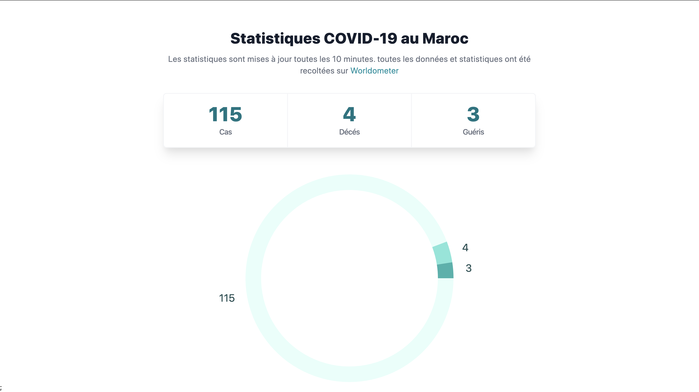

This is a [Next.js](https://nextjs.org/) project bootstrapped with [`create-next-app`](https://github.com/zeit/next.js/tree/canary/packages/create-next-app).
It is a simple project that shows the number of cases, deceased and recovered numbers of COVID-19 in Morocco using the [novelcovid API](https://github.com/novelcovid/api)
and uses TailwindCSS and TailwindUI.

## Running the project locally

Clone the project: 

```bash
git clone git@github.com:ceeyahya/morocco-covid-tracker.git
```

Install Dependencies:

```bash
yarn
```


Run the development server:

```bash
yarn dev
```

Open [http://localhost:3000](http://localhost:3000) with your browser to see the result.

